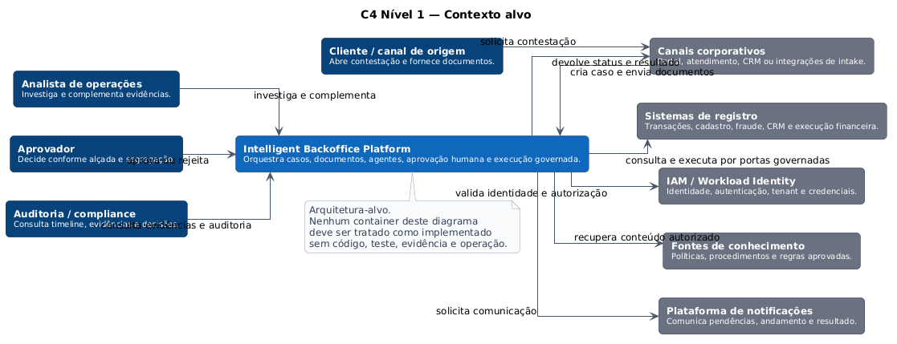

# Intelligent Backoffice Platform Architecture

[](https://github.com/leandrosflora/intelligent-backoffice-platform-architecture/actions/workflows/quality.yml)
[](https://github.com/leandrosflora/intelligent-backoffice-platform-architecture/actions/workflows/vertical-slice.yml)
[](https://github.com/leandrosflora/intelligent-backoffice-platform-architecture/actions/workflows/p5-observability-evals.yml)
[](https://github.com/leandrosflora/intelligent-backoffice-platform-architecture/actions/workflows/p6-eventing.yml)
[](https://github.com/leandrosflora/intelligent-backoffice-platform-architecture/actions/workflows/p7-production-readiness.yml)
[](https://github.com/leandrosflora/intelligent-backoffice-platform-architecture/actions/workflows/docs.yml)

Arquitetura de referência executável para automação inteligente de backoffice com agentes, processamento documental, workflows persistentes, human-in-the-loop, policies, auditoria e integração governada com sistemas corporativos.

## Princípio central

> A IA produz análise e recomendação. O workflow controla o processo. Policies determinam o que pode ser feito. Pessoas aprovam decisões sensíveis. Serviços de domínio executam operações em sistemas de registro.

## Case aplicado

O primeiro case demonstra uma jornada bancária de contestação:

1. abertura e triagem;
2. recebimento e validação documental;
3. investigação;
4. recomendação explicável;
5. aprovação humana conforme alçada;
6. execução governada e idempotente;
7. reconciliação, auditoria e encerramento.

## O que o repositório demonstra

- vertical slice FastAPI com lifecycle persistido;
- OPA em runtime com `default deny`, alçada e purpose binding;
- aprovação humana e execução mock idempotente;
- OpenAPI, AsyncAPI, JSON Schemas e catálogo de policies;
- outbox, inbox, workers, timers, DLQ e replay;
- evals versionados com gates de abstention e grounding;
- métricas, traces, dashboards, SLOs, alertas e runbooks;
- JWT EdDSA local para identidade humana e de workload;
- backup criptografado, restore, SBOM e proveniência;
- manifests Kubernetes alvo com HA e controles de rede;
- matriz explícita de production readiness.

## Arquitetura

[](docs/assets/diagrams/c4-context-target.svg)

A documentação separa quatro conceitos:

- **atual:** capacidade confirmada por código, configuração, teste ou evidência;
- **baseline executável:** controle demonstrado localmente ou no CI;
- **alvo:** responsabilidade ou topologia planejada;
- **produção:** integração real, operação e governança aprovadas.

## Executar localmente

Runtime mínimo:

```bash
docker compose --profile runtime up --build
```

Observabilidade:

```bash
OTEL_TRACING_ENABLED=true docker compose --profile observability up --build
```

Workflow distribuído:

```bash
docker compose --profile distributed up --build
python scripts/run_p6_distributed_e2e.py
```

Profile com identidade assinada:

```bash
python scripts/generate_dev_identity.py --force
docker compose --profile secure up --build
python scripts/run_p7_secure_e2e.py
```

## Documentação

- [Documentação publicada](https://leandrosflora.github.io/intelligent-backoffice-platform-architecture/)
- [Como ler esta arquitetura](docs/guide/how-to-read.md)
- [Contexto de negócio](docs/context/business-context.md)
- [Arquitetura técnica](docs/architecture/index.md)
- [Contratos executáveis](docs/contracts/index.md)
- [Implementação de referência](docs/implementation/index.md)
- [Production readiness](docs/governance/production-readiness.md)
- [Roadmap e histórico](docs/roadmap.md)

## Production readiness

O status oficial permanece **`NOT_PRODUCTION_READY`**. Os controles locais comprovam padrões, não uma implantação corporativa multi-região.

Produção ainda exige identidade corporativa ou SPIFFE, mTLS, secret manager e KMS gerenciados, assinatura com admission control, database e Kafka Multi-AZ, testes representativos, DR real e operação 24x7.

## Validação completa

```bash
python scripts/validate_structure.py
python scripts/validate_contracts.py
python scripts/validate_observability.py
python scripts/validate_eventing.py
python scripts/validate_p7.py
PYTHONPATH=samples/vertical-slice python scripts/run_evals.py
bash scripts/test-policies.sh
python scripts/validate_diagrams.py
bash scripts/render-diagrams.sh
mkdocs build --strict
docker compose --profile secure config
```