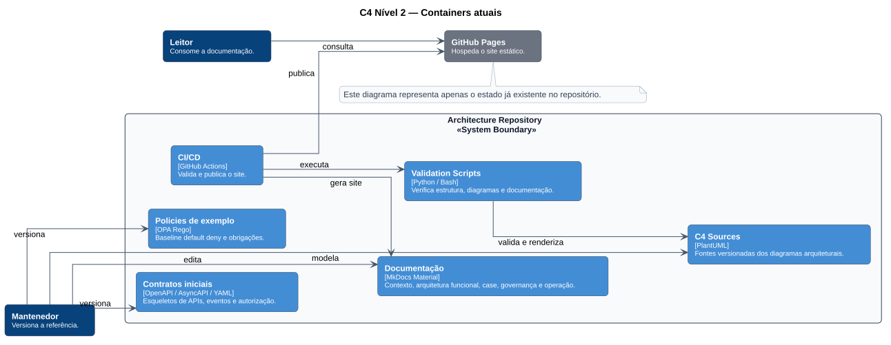

# C4 — Containers atuais

O nível de containers atual representa os elementos já existentes no repositório.

## Containers existentes

| Container | Estado |
|---|---|
| Documentação MkDocs | Implementado |
| Fontes C4 PlantUML | Implementado no P2 |
| Contratos iniciais | Implementado como baseline |
| Policy Rego de exemplo | Implementada como baseline |
| Scripts de validação | Implementados |
| GitHub Actions | Implementado |

Não há containers executáveis do domínio de contestação neste estágio.

**Fonte PlantUML:** `C4/c4-container-current.puml`.
