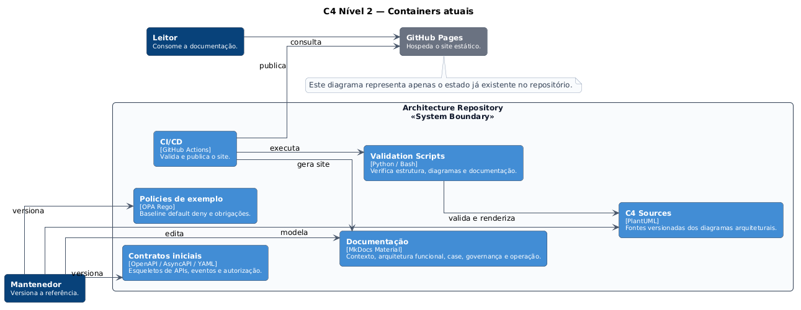

# C4 — Containers atuais

O nível de containers atual separa duas trilhas:

1. **implementação de produto iniciada**, formada pelo frontend React e pelo backend .NET;
2. **baseline executável de arquitetura**, mantida neste repositório para demonstrar padrões e controles.

[**Abrir diagrama em SVG**](../assets/diagrams/c4-container-current.svg)

## Implementação de produto iniciada

| Container | Tecnologia | Responsabilidade | Estado |
|---|---|---|---|
| Intelligent Backoffice Frontend | React 19 / Vite | Jornada de casos, documentos, evidências, investigação, aprovação, execução e reconciliação | `IMPLEMENTATION_STARTED` |
| Frontend Reverse Proxy | Nginx | Serve a SPA e encaminha `/api` ao backend | `IMPLEMENTATION_STARTED` |
| Backoffice Platform API | .NET 9 / ASP.NET Core | Domínio, lifecycle, versionamento otimista, execução idempotente e timeline | `IMPLEMENTATION_STARTED` |
| Backoffice Database | PostgreSQL 16 | Persistência dos agregados e recursos da jornada | `IMPLEMENTATION_STARTED` |
| Policy Decision Point | OPA / Rego | Autorização, alçada, segregação, tenant, purpose e obrigações | `IMPLEMENTATION_STARTED` |

### Fluxo atual

- o navegador executa a SPA React;
- em desenvolvimento, o Vite encaminha `/api` para a API .NET;
- no empacotamento Docker, o Nginx atua como reverse proxy;
- a API persiste dados no PostgreSQL;
- operações governadas consultam o OPA por HTTP;
- o gateway de execução permanece mock.

## Baseline executável de arquitetura

| Container | Responsabilidade |
|---|---|
| Reference Runtime | Profiles FastAPI para runtime, identidade assinada, eventing e observabilidade |
| Reference State Stores | SQLite para estado, outbox, inbox, timers e dead letters |
| Reference Event Backbone | Redpanda single-node para demonstração de eventos |
| Reference Observability Stack | OpenTelemetry, Prometheus, Grafana e Jaeger |
| Architecture Evidence Toolchain | E2E, evals, contratos, policies, diagramas, backup, SBOM, proveniência e readiness |

A baseline permanece `DEMONSTRATED_LOCAL`. Ela não é uma dependência de runtime do backend .NET; é uma fonte de padrões, contratos e evidências.

## Gaps de integração

- não existe Compose único para frontend, API, PostgreSQL e OPA;
- não existe E2E automatizado cross-repo;
- recomendações e aprovações ainda não possuem endpoints de recuperação por caso;
- identidade corporativa e workload identity ainda não foram incorporadas aos repositórios de produto;
- eventing e observabilidade da baseline ainda não foram migrados para o backend de produto.

!!! warning "Limite arquitetural"
    Código implementado e pipelines independentes não equivalem a uma integração validada. A classificação `VALIDATED_INTEGRATION` exige execução conjunta, evidências reproduzíveis e critérios operacionais aprovados.

Consulte:

- [repositórios de implementação do produto](../implementation/product-repositories.md);
- [matriz de implementação atual × alvo](implementation-status.md).

**Fonte PlantUML:** `C4/c4-container-current.puml`.
