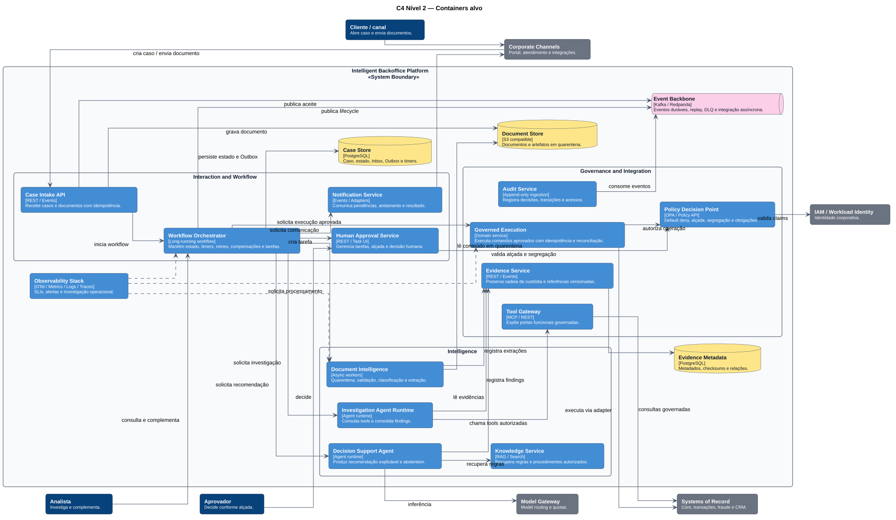

# C4 — Containers alvo

O modelo alvo separa interação, workflow, inteligência, governança, execução, dados e observabilidade.

## Decisões principais

- o **Workflow Orchestrator** é a autoridade sobre estado e transições;
- agentes investigam e recomendam, mas não aprovam nem executam;
- o **Policy Decision Point** aplica default deny, alçada e segregação;
- o **Tool Gateway** expõe portas funcionais, não payloads legados;
- apenas **Governed Execution** realiza operações mutáveis;
- documentos permanecem em armazenamento de quarentena até validação;
- eventos carregam correlação e suportam deduplicação e replay.

Os containers são responsabilidades lógicas. O vertical slice pode consolidar alguns deles no mesmo processo sem eliminar suas fronteiras.

**Fonte PlantUML:** `C4/c4-container-target.puml`.
