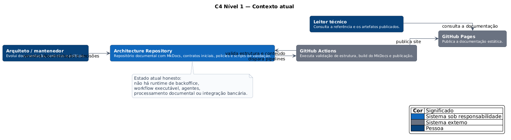

# C4 — Contexto atual

O estado atual é deliberadamente simples: o repositório publica uma referência arquitetural, contratos iniciais e policies de exemplo. Não existe runtime de backoffice implementado.

[**Abrir diagrama em SVG**](../assets/diagrams/c4-context-current.svg)

## Leitura

- o mantenedor versiona os artefatos;
- GitHub Actions valida e publica;
- GitHub Pages entrega a documentação;
- nenhum serviço de workflow, agente, documento ou execução está em operação.

**Fonte PlantUML:** `C4/c4-context-current.puml`.
