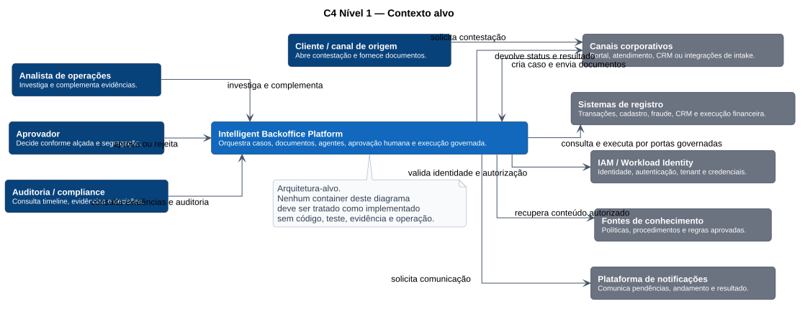

# C4 — Contexto alvo

O contexto alvo posiciona a plataforma entre canais, pessoas, fontes de conhecimento, identidade corporativa e sistemas de registro.

## Responsabilidade da plataforma

A plataforma deve:

- receber casos e documentos por canais governados;
- sustentar workflows de longa duração;
- apoiar investigação e recomendação;
- exigir aprovação humana quando aplicável;
- executar apenas operações autorizadas e idempotentes;
- preservar evidências, auditoria e rastreabilidade.

O diagrama é **arquitetura-alvo**, não inventário de implementação.

**Fonte PlantUML:** `C4/c4-context-target.puml`.
