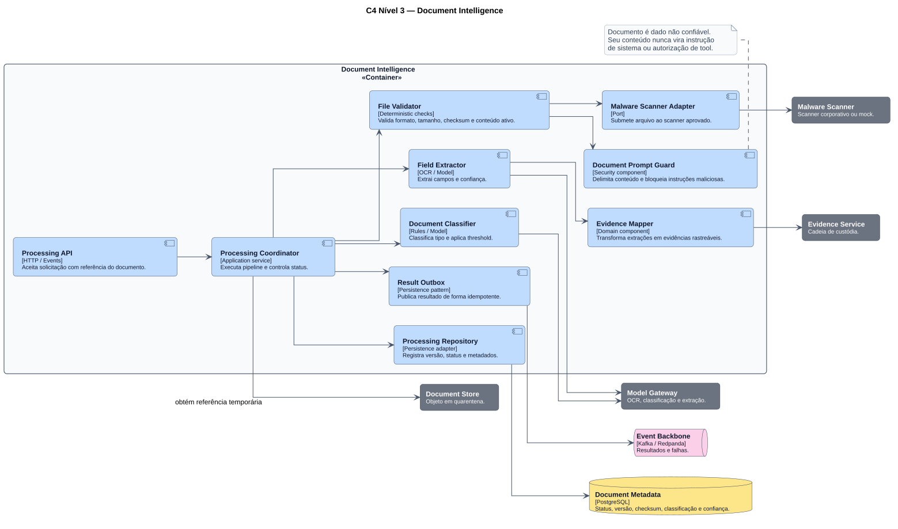

# Componentes — Document Intelligence

Document Intelligence trata documentos como conteúdo não confiável e produz evidências rastreáveis, nunca autorização ou decisão final.

## Pipeline

1. recebe referência temporária do documento;
2. valida formato, tamanho, checksum e conteúdo ativo;
3. executa malware scan;
4. delimita o conteúdo contra prompt injection;
5. classifica o documento;
6. extrai campos e confiança;
7. transforma extrações em evidências versionadas;
8. publica resultado por Outbox.

## Restrições

- documento integral não circula em eventos;
- instruções contidas no arquivo não controlam prompts ou tools;
- baixa confiança gera revisão ou solicitação de complemento;
- toda evidência preserva origem, versão e localização.

**Fonte PlantUML:** `C4/c4-component-document-intelligence.puml`.
