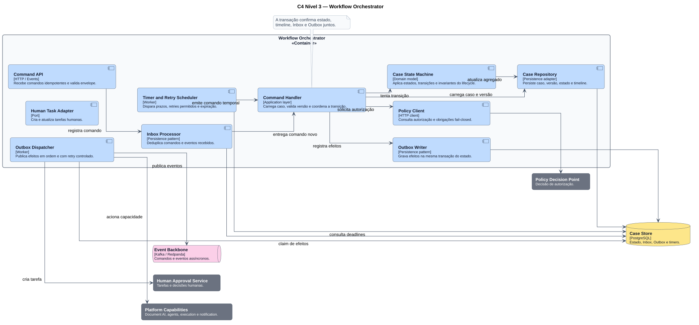

# Componentes — Workflow Orchestrator

O Orchestrator aplica o lifecycle definido no P1 e coordena efeitos sem acoplar a máquina de estados às integrações externas.

## Garantias

- Inbox para deduplicação de comandos e eventos;
- versionamento otimista do caso;
- máquina de estados com invariantes explícitas;
- policy check fail-closed antes da transição;
- estado, timeline e Outbox confirmados na mesma transação;
- timers e retries limitados por regra;
- dispatcher de efeitos com backoff e observabilidade.

## Regra de dependência

O domínio conhece portas como `DocumentProcessing`, `HumanTask` e `GovernedExecution`. Adapters e tecnologias concretas ficam fora da máquina de estados.

**Fonte PlantUML:** `C4/c4-component-workflow-orchestrator.puml`.
