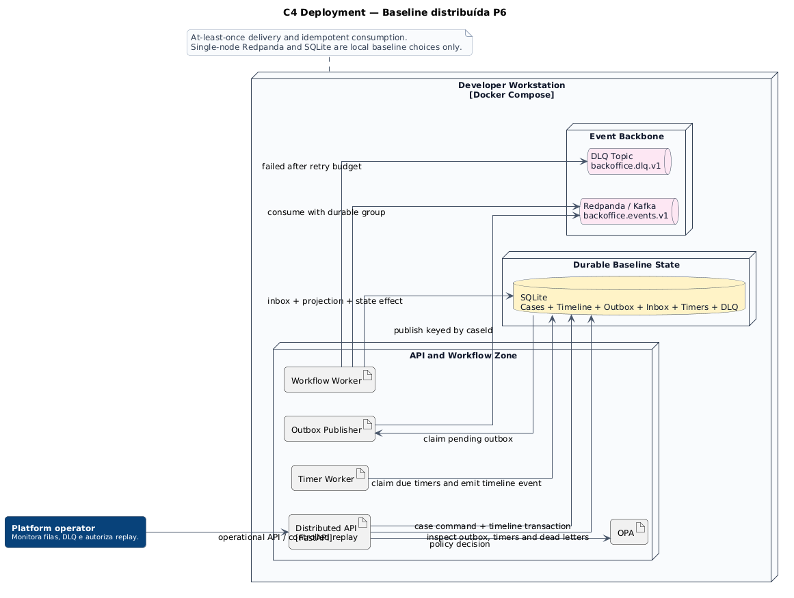

# Deployment distribuído

[**Abrir diagrama em SVG**](../assets/diagrams/c4-deployment-distributed-baseline.svg)

Esta visão adiciona uma baseline executável assíncrona sem substituir os profiles mínimo, observado ou seguro.

## Componentes implementados

- API FastAPI com transactional outbox habilitado;
- Redpanda compatível com Kafka;
- outbox publisher;
- workflow worker com inbox idempotente;
- timer worker;
- armazenamento durável de dead letters;
- replay autorizado por OPA e auditado.

## Limites

SQLite, broker single-node, replication factor um e identidades locais não representam produção. A arquitetura produtiva deve definir HA, retenção, ACLs, criptografia, schema registry, capacidade, recuperação e segregação operacional.

**Fonte PlantUML:** `C4/c4-deployment-distributed-baseline.puml`.