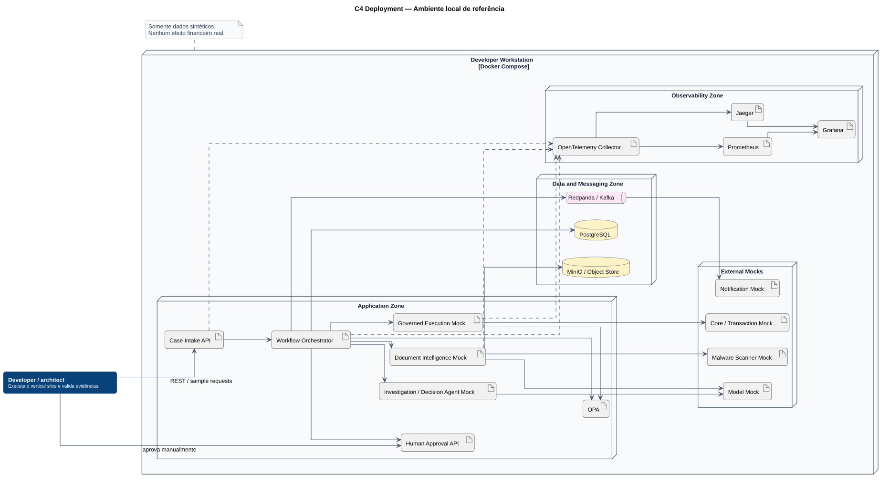

# Deployment local

O deployment local do P4 usa Docker Compose e dados exclusivamente sintéticos.

## Implementado no P4

| Serviço | Tecnologia | Estado |
|---|---|---|
| API | ASP.NET Core / .NET 10 | implementado |
| PostgreSQL | PostgreSQL 17 | implementado |
| Policy Decision Point | OPA | implementado |
| Document Intelligence | módulo mock dentro da API | implementado |
| Human Approval | módulo dentro da API | implementado |
| Governed Execution | módulo mock dentro da API | implementado |

## Ainda alvo

- Kafka ou Redpanda;
- object storage;
- malware scanner;
- modelo de IA real;
- Core bancário mock separado;
- OpenTelemetry Collector;
- Prometheus, Jaeger e Grafana.

O diagrama permanece mais amplo que a baseline P4 para orientar as próximas fases.
A visão de containers atuais distingue o que já está executável.

**Fonte PlantUML:** `C4/c4-deployment-local.puml`.
