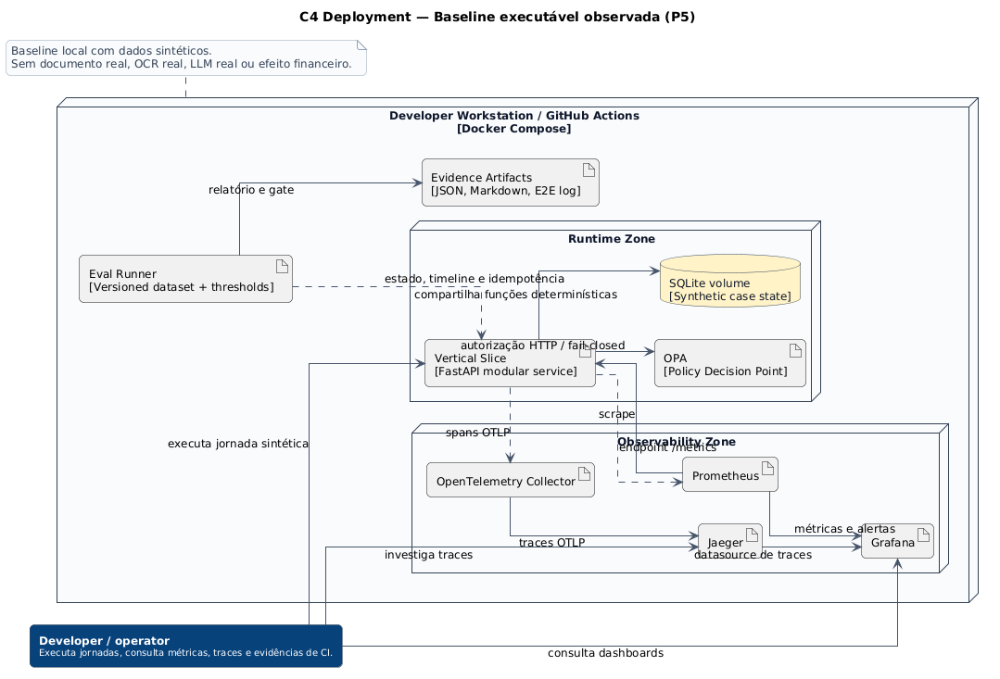

# Deployment observado do P5

[**Abrir diagrama em SVG**](../assets/diagrams/c4-deployment-observed-baseline.svg)

## Leitura

Esta visão representa a **baseline executável confirmada** do P5:

- serviço FastAPI modular;
- OPA externo ao processo;
- SQLite local para estado sintético;
- métricas via Prometheus;
- traces via OpenTelemetry Collector e Jaeger;
- dashboard Grafana;
- eval runner com dataset e thresholds versionados;
- evidence artifacts publicados no CI.

Ela substitui interpretações de que o deployment alvo com PostgreSQL, Kafka, object store e serviços independentes já estaria implementado.

## Limites

A observabilidade é local, sem autenticação corporativa, retenção, multi-região, SRE on-call ou dados reais.

**Fonte PlantUML:** `C4/c4-deployment-observed-baseline.puml`.
