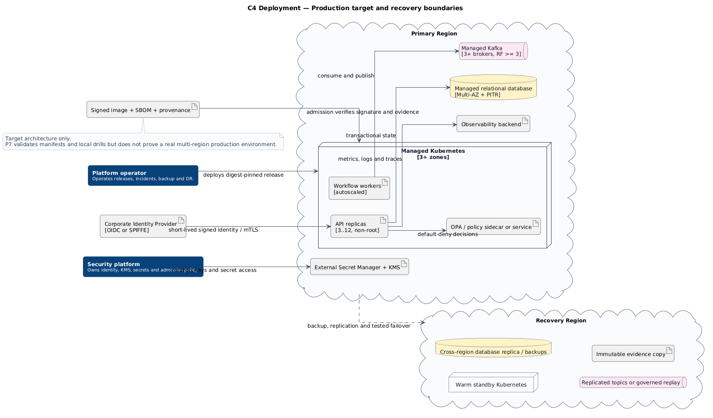

# Deployment alvo de produção

[**Abrir diagrama em SVG**](../assets/diagrams/c4-deployment-production-target.svg)

## Características

- Kubernetes distribuído por três ou mais zonas;
- API e workers com autoscaling;
- banco gerenciado Multi-AZ e point-in-time recovery;
- Kafka com múltiplos brokers e replication factor adequado;
- identidade corporativa, mTLS, secret manager e KMS;
- imagens por digest com SBOM, proveniência e assinatura;
- região de recuperação com dados e evidências replicados.

Esta visão é **alvo**, não evidência de que esses serviços existem. Os manifestos em `deploy/kubernetes/` são contratos arquiteturais validados, não uma implantação produtiva executada pelo CI.

**Fonte PlantUML:** `C4/c4-deployment-production-target.puml`.
