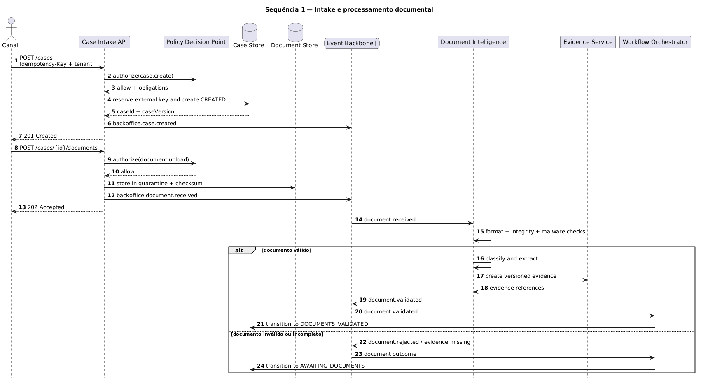
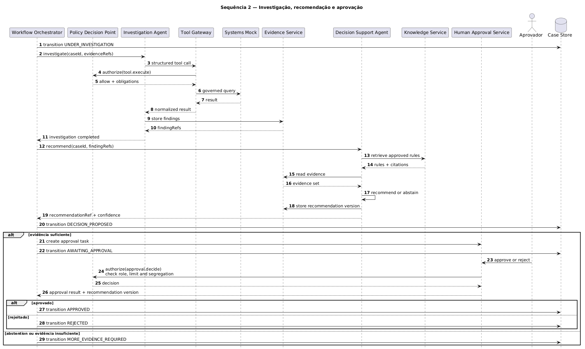
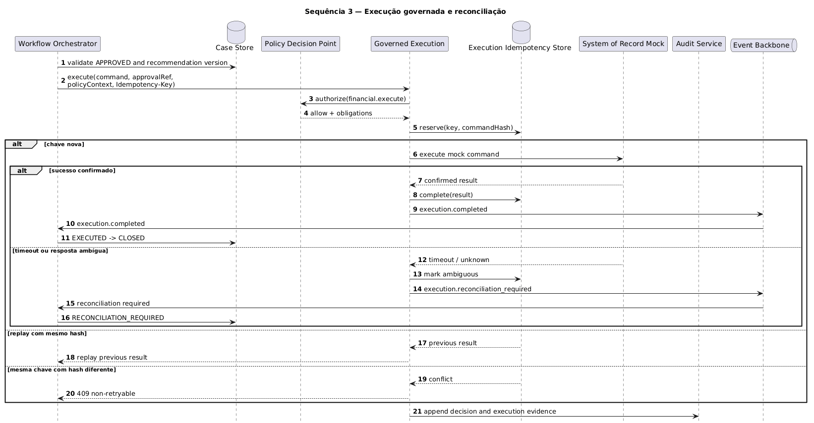
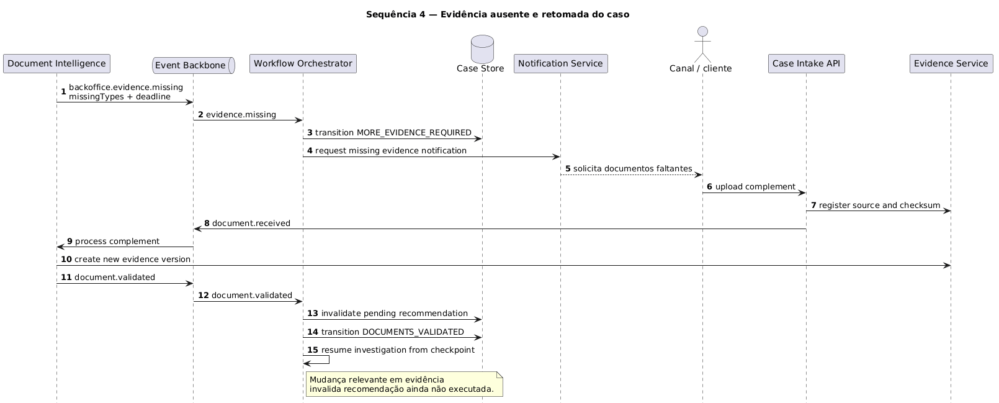
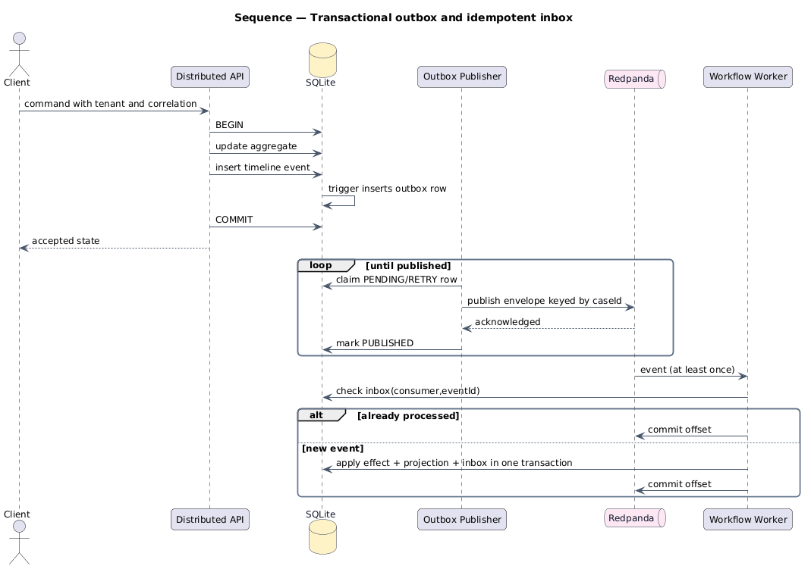
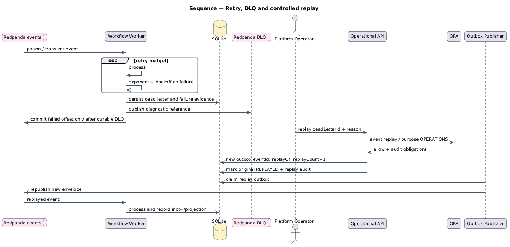

# Diagramas de sequência

Os fluxos abaixo conectam o lifecycle funcional a responsabilidades técnicas. Cada PNG pode ser clicado para abrir a versão vetorial em SVG.

## Intake e processamento documental

[**Abrir diagrama em SVG**](../assets/diagrams/sequence-case-intake.svg)

## Investigação, recomendação e aprovação

[**Abrir diagrama em SVG**](../assets/diagrams/sequence-investigation-approval.svg)

## Execução governada e reconciliação

[**Abrir diagrama em SVG**](../assets/diagrams/sequence-governed-execution.svg)

## Evidência ausente e retomada

[**Abrir diagrama em SVG**](../assets/diagrams/sequence-missing-evidence.svg)

## Transactional outbox e inbox idempotente

[**Abrir diagrama em SVG**](../assets/diagrams/sequence-outbox-delivery.svg)

Garantias:

- mudança de estado e evento no mesmo commit;
- entrega at least once;
- ordenação por chave de caso dentro da partição;
- deduplicação por consumidor e `eventId`;
- offset confirmado apenas após resultado durável.

## Retry, DLQ e replay controlado

[**Abrir diagrama em SVG**](../assets/diagrams/sequence-retry-dlq-replay.svg)

Garantias:

- retry budget finito;
- dead letter preservada;
- autorização OPA com finalidade operacional;
- novo `eventId` e referência ao original;
- motivo e ator registrados no replay audit.
