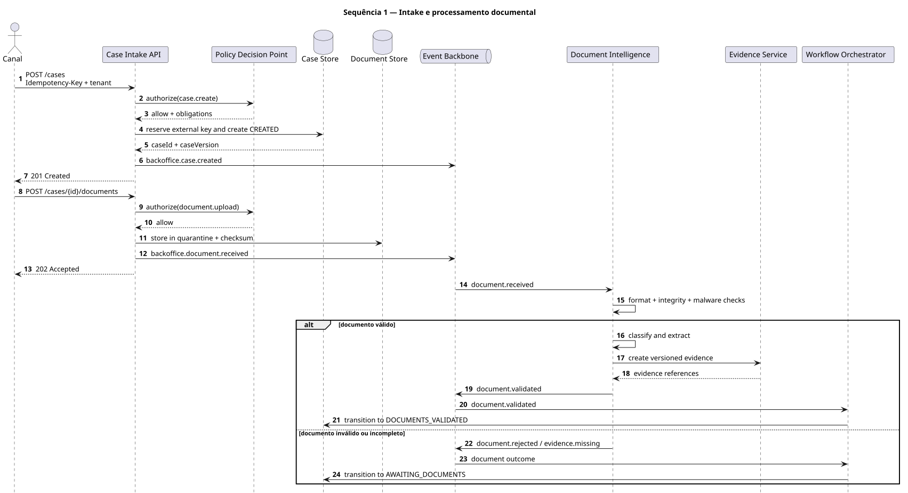
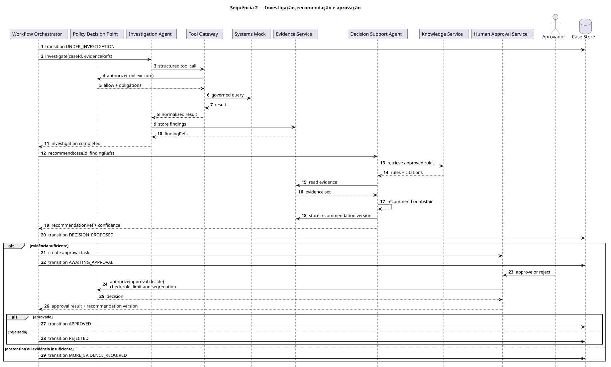
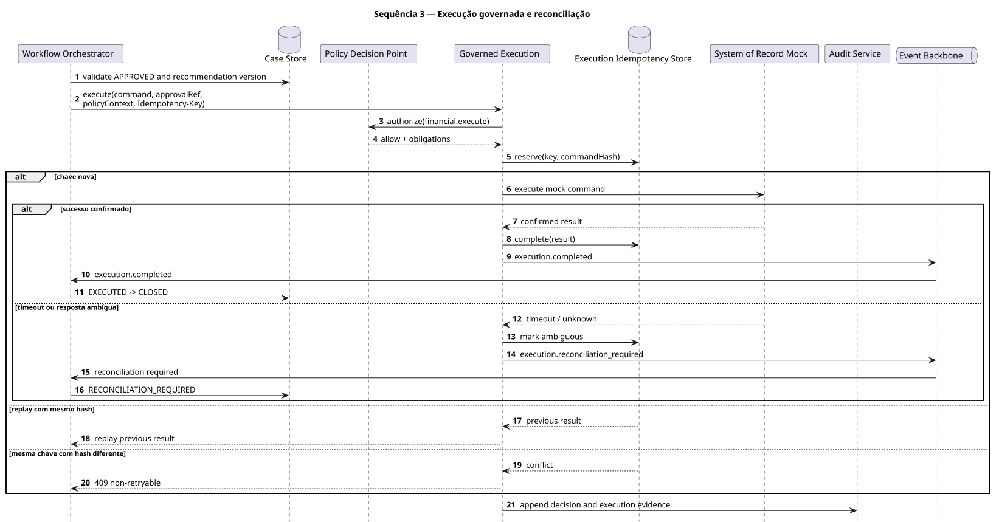
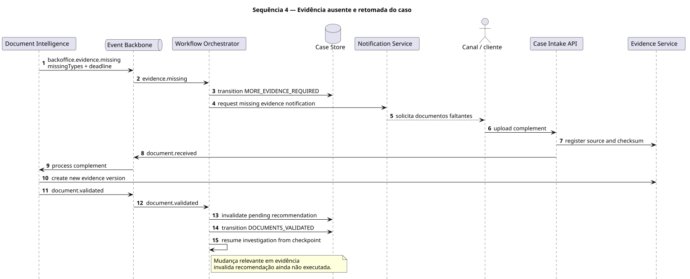

# Diagramas de sequência

Os fluxos abaixo conectam o lifecycle funcional a responsabilidades técnicas.

## 1. Intake e processamento documental

Principais garantias:

- criação idempotente;
- ACK antes do processamento assíncrono;
- documento em quarentena;
- evidência versionada;
- transição para `DOCUMENTS_VALIDATED` ou `AWAITING_DOCUMENTS`.

## 2. Investigação, recomendação e aprovação

Principais garantias:

- tools governadas;
- findings separados de inferências;
- recomendação com regras e evidências;
- abstention quando necessário;
- alçada e segregação verificadas pelo PDP.

## 3. Execução governada e reconciliação

Principais garantias:

- decisão `APPROVED` vigente;
- policy proof e obrigações;
- `Idempotency-Key` e hash do comando;
- replay determinístico;
- timeout ambíguo encaminhado para reconciliação.

## 4. Evidência ausente e retomada

Principais garantias:

- solicitação explícita de complemento;
- retomada por checkpoint;
- nova versão de evidência;
- invalidação da recomendação pendente.
