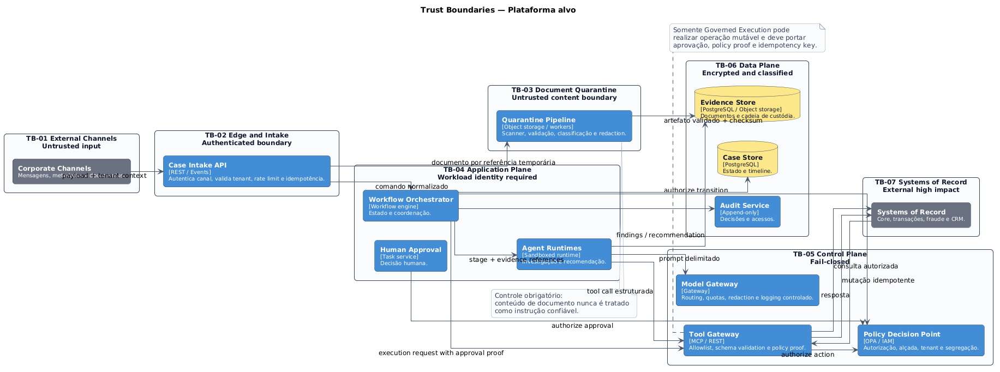

# Trust boundaries

As trust boundaries determinam onde autenticação, validação, redaction e policy enforcement devem ocorrer.

[**Abrir diagrama em SVG**](../assets/diagrams/c4-trust-boundaries.svg)

## Fronteiras

| ID | Fronteira | Controle mínimo |
|---|---|---|
| TB-01 | Canais externos | assinatura, autenticação, rate limiting e idempotência |
| TB-02 | Edge e intake | tenant validado, schema e finalidade |
| TB-03 | Quarentena documental | malware scan, formato, checksum e isolamento |
| TB-04 | Application plane | workload identity e autorização por ação |
| TB-05 | Control plane | fail-closed, quotas, policy proof e allowlist |
| TB-06 | Data plane | criptografia, classificação, retenção e auditoria |
| TB-07 | Systems of Record | adapters certificados, idempotência e reconciliação |

## Regras transversais

- documentos são entrada não confiável;
- agentes recebem referências controladas;
- tools exigem identidade, tenant, estágio e finalidade;
- operações mutáveis exigem aprovação vigente e idempotência;
- telemetria não contém payload integral nem segredo.

**Fonte PlantUML:** `C4/c4-trust-boundaries.puml`.
